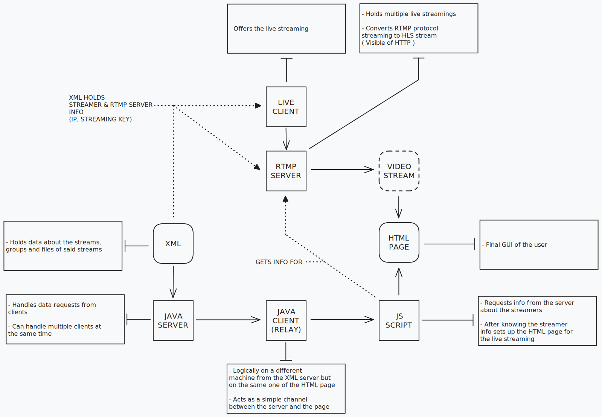

# Progetto server XML -> JAVA -> HTML per streaming live

## Descrizione

Il progetto consiste in un server JAVA che riceve un file XML, poi lo invia ad un client JAVA che lo invia ad una pagina HTML. La pagina HTML riceve i dati e visualizza in tempo reale una live streaming.

## Todo

- [x] Creare il server RTMP
- [ ] Setup del server RTMP
  - [ ] Setup del server RTMP per trasmissione in HDL
- [x] Creare XML
- [ ] Creare XSD
- [ ] Creare Server Java
  - [x] Connessione e accettazione client
  - [ ] Gestione singolo client
  - [x] Parsing dei dati XML
    - [x] Trovo i dati
    - [x] Creo file di risposta
    - [ ] Valuta se è necessario creare il file RESPONSE XML o posso semplicemente inviare i dati
      - [ ] Nel caso aggiungi la gestione dei file sul lato ClientManager come nel commento
- [ ] Creare Client Java
  - [ ] Connessione
  - [ ] Trasmissione dei dati tra i due end-point
- [ ] Creare la pagina HTML
  - [x] CSS  
  - [ ] JS
  - [ ] HTML
  - [ ] Connessione
  - [ ] Ricezione dei dati dal server
  - [ ] Visualizzazione dei dati  

## Possibili agginunte

 - [ ] Chat
 - [ ] Trova un modo per utilizzare il client java
 - [ ] Crea un hub per la gestione degli streamer
 - [ ] Possibilita di spostare su CLI che sarebbe piu figo
 - [ ] Live viewers & sub count

## Risorse

- GUARDA CHATGPT E LE TABELLE SU GOOGLE
- [XML save and modify](https://chat.openai.com/share/4e6a0dce-1e5c-4150-811b-1b1d60c8bf90)
- [Sockets JS to JAVA](https://chat.openai.com/share/1c773867-ed35-49d9-969e-fa1a7afa8635)